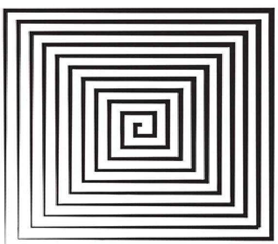

# MRT Software Induction Project : Quad-Search Strategy
*Madhav Agrawal*

## Introduction

In this project, I have worked to enhance our existing ArUco tag search strategy for the URC problem statement.

### Problem Statement
Our primary objective is to locate three posts which have GNSS Coordinates, within a 20-meter radius, each marked with a 3-sided marker displaying an ArUco tag. Once detected, our task is to navigate the rover to stop within 2 meters of each post. Therefore, our focus lies on efficiently searching for and identifying the ArUco tags within the specified radius to ensure accurate navigation and positioning of the rover.

### Current Strategy
Currently, we are using square search  strategy - in which we move the rover recursively to the vertices of squares and perform a 360 degree rotation. However, this year we will use rotating stereo camera to cut down this rotation effort!!

#### Cons of Current Strategy
Some of the major problems that we will be facing in the current strategy are: 

- Accuracy - There might be some chance that some area is left for scanning.
- **Blind spot** - The presence of the pole at the back of the rover creates a blind spot for the rotating stereo-camera, potentially causing it to fail to detect an ArUco tag positioned directly behind the rover.
- **Time** - In the long term, the rotation time required for the stereo-camera mount and the adjustments made to eliminate blind spots are factors that inevitably demand a significant amount of time.

## Solutions

To address the mentioned challenges, I suggest the following solutions to simplify and streamline the process of locating ArUco markers, thus making our task more efficient:

### Strategy - 0 : WebCams
In this proposed solution, we aim to utilize 3 or 4 webcams or standard cameras strategically positioned at angles of either 120° or 90° around the rover. This configuration offers a comprehensive view of the rover's surroundings without the need for camera rotation at each step. By eliminating this rotation process, we effectively reduce the time required for scanning and enhance efficiency in detecting ArUco markers.

#### Implementation
- To minimize complexity, we'll connect all cameras to a Raspberry Pi, leveraging its existing presence in rover and available pins. The Raspberry Pi will process webcam feeds to detect ArUco tags silently and compactly, ensuring streamlined operation.
- Upon detecting an ArUco tag, the Raspberry Pi will send a signal to the NUC, the main processing unit, prompting it to rotate the stereo-camera in the tag's direction to capture depth information.
- Simultaneously, the rover will be directed to move towards the tag's location.

#### Numbers
- The webcam's accuracy for ArUco detection is sufficient, delivering reliable results up to a minimum distance of 10 meters.
- Given that each camera costs approximately 1k, the overall cost of 3-4k for all cameras is within a reasonable budget range. Therefore, budget constraints are not a significant issue.

#### Pros
- Reduce the rotation time of camera/rover.
- Provides better range than stereo camera. In case, if we are unable to detect the ArUco marker using stereo-camera, we can still move in the direction in which webcam is detecting it.

#### Bonus
- By implementing video stabilization techniques, we can enable the rover to continuously search for ArUco markers without the need to stop, capture images, and detect markers sequentially. This dynamic approach enhances efficiency by allowing the rover to maintain constant movement while actively scanning its surroundings for ArUco markers in real-time, thereby saving valuable time during missions.

### Strategy-1 : Square Spiral
In this strategy, we will adopt a square-based spiral movement pattern, pausing for detection at corners or edges based on the radial distance from the center. 
[Check out this section](#SS)

### Strategy-2 : Circle Circle
This strategy involves searching for ArUco markers by moving in a circular pattern, ensuring comprehensive coverage of the area within two to three rounds. 
[Check out this section](#CC)

## Strategy-1 : Square Spiral 

In this strategy, we will adopt a square-based spiral movement pattern, pausing for detection at corners or edges based on the radial distance from the center.

In this approach, the rover will traverse along the edges of a square, gradually increasing the edge length at a constant rate, resulting in a spiral trajectory. Figure 2 illustrates an example of this described path.

Based on whether the square index of the edge is even or odd, the rover will stop for detection at corners if the square index is odd, or at points gained after bisecting, trisecting, quadrasacting, etc., the edge, depending on its length.

To see the simulation of the above strategy, check out [this video](https://github.com/madhav48/MRT-Quad-Search-Strategy/blob/main/Strategy%201%20-%20Simulation.mp4).

### Numbers and Calculations
The following provides an overview of the key data points that will influence the strategy:

This strategy has 5 main variables:
- Initial edge length
- Factor determining the rate of increase in square length
- Rate at which divisions increase along the edges with an even square index.
- Initial Divisions of the edge with an even square index.
- Max iterations (edges)

Which depends on the factors:

- Accuracy of the stereo-camera.
- Search range which is 20 m.

By assuming a stereo-camera accuracy of 5m, I calibrated the variables accordingly to maximize efficiency. Through this analysis, I determined that within a maximum of 23 edges (or 6 squares), we can effectively cover a range of 20m using this strategy. This process involves the detection of ArUco markers at a maximum of 32 locations. In total, the rover covers approximately 414 meters in distance.

For a more detailed understanding and to explore alternative parameters, please refer to [this](https://github.com/madhav48/MRT-Quad-Search-Strategy/blob/main/Strategy%20Scripts%20(Simulation)/strategy1.py) simulation script.

### Pros
- This strategy excels in accuracy for locating ArUco tags, as it searches at very close to near points.
- The low numbers of 23 edges and 32 detections indicate high efficiency, especially considering the stereo-camera's minimum 5m accuracy. This strategy is expected to be good time-efficient.
- The square-based pattern of this strategy, involving 90-degree turns, simplifies rover's turning process, compared to a spiral pattern.
- This strategy aligns with the problem statement by efficiently finding ArUcos in increasing distances from the center, enabling rapid detection of nearby ArUcos.

### Cons
- This strategy exhibits significant overlap in the regions scanned by the stereo-camera, leading to reduced efficiency.
- Despite the low number of detections, the rover's travel distance of approximately 400-450 meters may consume a significant amount of time, potentially posing a time challenge.

### Improvements
As we've identified both advantages and disadvantages of this strategy, we can explore potential improvements to enhance its effectiveness. One such enhancement could involve introducing an angle between the edges of consecutive squares to minimize overlap. Additionally, we can brainstorm further to optimize the strategy to improve efficiency!

## Strategy-2 : Circle Circle 

In this strategy, our objective is to systematically scan the area by traversing in circular-like paths around the center, completing 2-3 rounds at varying radii. Since direct circular movement is not feasible, we'll instead follow the edges of a polygon with 'n' sides, scanning for ArUco tags at each vertex. This approach creates a pseudo-circular trajectory, mimicking the behavior of a circle for effective coverage.

Our approach begins with scanning at the mission's starting point, the center. We then proceed to a vertex of the first polygon inscribed within a circle with a radius of x meters. Moving along the polygon's edges, we scan at each vertex, before transitioning to a larger polygon inscribed within a circle with a radius of y meters (where y \textgreater x). This process iterates until we've covered the entire range, ensuring comprehensive area coverage.

To see the simulation of the above strategy, check out [this video](https://github.com/madhav48/MRT-Quad-Search-Strategy/blob/main/Strategy%202%20-%20Simulation.mp4).

### Numbers and Calculations
The following provides an overview of the key data points that will influence the strategy:

This strategy has 3 main variables:
- Number of sides of polygon (n)
- Factor for determining the radius of each circle (f)
- Number of polygons (2-3)

which decides the edge length of the inscribed polygon by having a relation given by:

\[edge\_length = 2*f*stereo\_accuracy*sin(2\pi/n)\]

These variables depends on the factors:

- Accuracy of the stereo-camera.
- Search range which is 20 m.

After conducting trial and error experiments, I have identified several potential combinations:

(See more details in the original LaTeX document)

### Pros
- The numbers indicate that this strategy involves covering a relatively short distance, allowing the rover to move quickly and efficiently.
- This strategy is also in alignment with our problem statement as it prioritizes the rapid detection of nearby ArUco markers.
- Implementing the strategy within polygons rather than circles facilitates easier control of the rover's movements.
- This strategy aims to maximize the utilization of the stereo-camera's full accuracy range, thereby minimizing the time required and enhancing overall efficiency.

### Cons
- The primary challenge of this strategy lies in managing sharp turns. To address this challenge, we opt for fewer edges, allowing for increased turning angles and more effective control. This is crucial as sharp angles may compromise the rover's turning accuracy, potentially leading to errors.
- Errors are more likely to occur when attempting to move the rover within the range of 18-30 degrees (for 12-20 edges), potentially resulting in uncovered spots within the 20-meter region.

## Conclusion

In summary, both Strategy-1 and Strategy-2 offer significant improvements over the existing approach and can enhance efficiency. Implementing Strategy-0 alongside these strategies will further simplify our task and reduce time requirements. Techniques like video stabilization will greatly aid in ArUco marker detection.

Comparing Strategy-1 and Strategy-2, each has its own strengths. Strategy-1 benefits from mechanical advantages due to its 90-degree turns, while Strategy-2 covers a shorter distance (1/3 of the distance in Strategy-1). Therefore, either strategy can be effectively utilized to streamline our operations.
